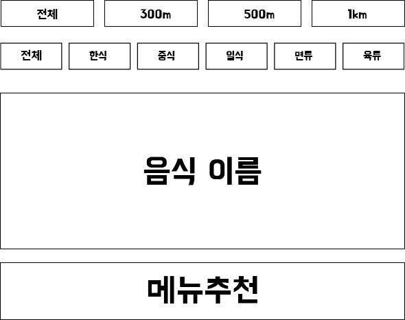

# 오늘 뭐먹지?

###코드스쿼드 주변 음식점 랜덤 추천 프로그램

---

#### 프로그램 설명
코드스쿼드 주변 맛집을 랜덤으로 추천해주는 프로그램입니다.  
음식 카테고리와 거리를 선택하여 랜덤범위를 한정 할 수 있습니다.  
마스터즈 코스에 합류하게 되었을 때를 상상하며,  
선택장애가 있는 저에게 보다 쉽게 메뉴를 선택하기 위해 제작하게 되었습니다.

#### 기능사항

- 거리순으로 선택 할 수 있다. (ex. 300m, 500m, 1km, 전체)
- 음식 카테고리를 선택 할 수 있다.(ex. 한식, 중식, 일식, 면, 육류, 전체)
- 랜덤추천 버튼을 누르면 랜덤으로 음식점을 추천해준다.

#### 추가구현
- 음식점을 추가 수정 삭제 할 수 있다.

#### 예상 프로그램 화면

